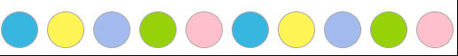
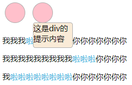
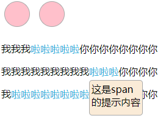

## 循环样式
#### 源代码
```html
<!DOCTYPE html>
<html lang="en">
  <head>
    <meta charset="UTF-8" />
    <meta name="viewport" content="width=device-width, initial-scale=1.0" />
    <meta http-equiv="X-UA-Compatible" content="ie=edge" />
    <title>Document</title>
    <style>
      .toprow{
        margin-bottom: 10px;
        display: flex;
      }
      .small{
        width: 40px;
        height: 40px;
        margin: 5px;
        border-radius: 50%;
        border:1px solid #aaaaaa;
      }
      .small:nth-child(5n + 1) {
        background-color: #37b6df;
      }

      .small:nth-child(5n + 2) {
        background-color: #fff456;
      }
      .small:nth-child(5n + 3) {
        background-color: #a3baee;
      }
      .small:nth-child(5n + 4) {
        background-color: #97d208;
      }
      .small:nth-child(5n + 5) {
        background-color: pink;
      }
    </style>
  </head>
  <body>
    <div class="toprow">
      <div class="small"></div>
      <div class="small"></div>
      <div class="small"></div>
      <div class="small"></div>
      <div class="small"></div>
      <div class="small"></div>
      <div class="small"></div>
      <div class="small"></div>
      <div class="small"></div>
      <div class="small"></div>
      <div class="small"></div>
      <div class="small"></div>
    </div>
  </body>
</html>
```
#### 效果


#### 注意:
- nth-child(5n + 1) 应该在需要循环样式的div的类名中, 而不是父类中
- 5代表循环的个数
- 除了需要变化的样式写在nth-child(5n + 1)中, 其余写在普通类中


## 悬浮提示框
#### 源代码
```html
<!DOCTYPE html>
<html lang="en">
  <head>
    <meta charset="UTF-8" />
    <meta name="viewport" content="width=device-width, initial-scale=1.0" />
    <meta http-equiv="X-UA-Compatible" content="ie=edge" />
    <title>Document</title>
    <style>
      .toprow{
        margin-bottom: 10px;
      }
      .small{
        width: 40px;
        height: 40px;
        margin: 5px;
        border-radius: 50%;
        border:1px solid #aaaaaa;
        background-color: pink;
      }
      .data{
        margin-bottom: 100px;
        width: 300px;
        display: block;
      }
      span[data-descr] {
        position: relative;
        cursor: pointer;
        color: #37b6df;
      }
      span[data-descr]:hover::after {
        content: attr(data-descr);
        background-color: antiquewhite;
        border: #aaaaaa solid 1px;
        width: 80px;
        height: 50px;
        padding: 3px;
        color: black;
        border-radius: 5px;
        position: absolute;
        left: 0;
        top: 25px;
        z-index: 1;
      }
      .toprow div{
        display: inline-block;
        position: relative;
      }
      div[data-descr]:hover::after {
        content: attr(data-descr);
        background-color: antiquewhite;
        border: #aaaaaa solid 1px;
        width: 80px;
        height: 50px;
        color: black;
        border-radius: 5px;
        position: absolute;
        left: 0px;
        top: 40px;
        z-index: 1;
      }
    </style>
  </head>
  <body>
    <div class="toprow">
      <div class="small" data-descr="这是div的提示内容"></div>
      <div class="small" data-descr="这是div的提示内容"></div>
    </div>
    <div class="data"> 
      <p>我我我<span data-descr="这是span的提示内容">啦啦啦啦啦</span>你你你你你你你你</p>
      <p>我我我我我我我我我<span data-descr="这是span的提示内容">啦啦啦</span>你你你你</p>
      <p>我<span data-descr="这是span的提示内容">啦啦啦啦啦啦啦啦</span>你你你你你你你</p>
    </div>
  </body>
</html>
```

#### 效果
**div的提示框**    


**span的提示框**    


#### 注意
- 关键词:  after, content: attr(data-descr);
- 悬浮框应该有个最大的 z-index
- 被悬浮元素 span[data-descr], div 定位为 relative , 提示框元素 :hover::after 定位为 absolute, 这样悬浮框才不会影响其他地方
- 提示框的样式写在 after 里
